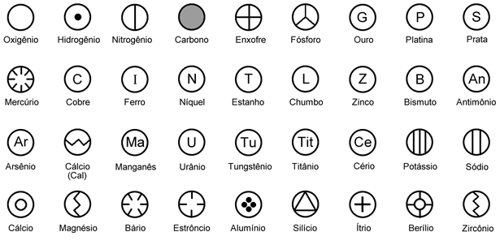

John Dalton criou alguns símbolos para representar os elementos químicos conhecidos à sua época. Os símbolos são os seguintes:

    

Apesar de aparecer em alguns lugares com "tabela", os símbolos não tem nenhuma organização periódica ou lógica, e são apenas representações dos elementos.

----

<small>_Nota_: essa é a terceira publicação deste mesmo post. Originalmente postado em meu blog criado em Ruby on Rais em 2011, este "post" foi depois migrado para o Blogger, onde ainda pode ser visto [aqui](http://blog.alanmol.com.br/2015/05/os-elementos-quimicos-segundo-dalton.html).</small>