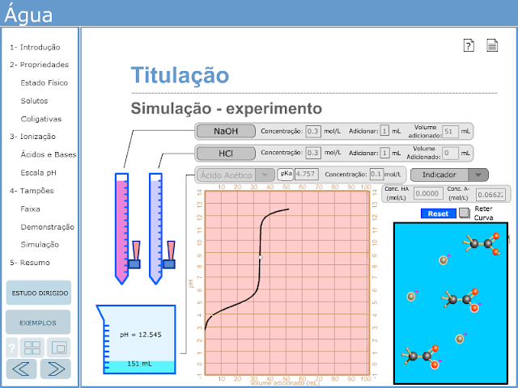

Ontem me dei conta que, agora que tenho um site, posso compartilhar outras coisas que já fiz na vida, não tão inúteis. Mais especificamente, os objetos que produzi durante a graduação, por Iniciação Científica e Estágio, no laboratório de Bioquímica e Química de Proteínas, na UnB, sob a orientação do Prof. Dr. Wagner Fontes.

O primeiro destes é também o primeiro em que trabalhei: Um sistema interativo, feito no bom e velho Macromedia Flash, com conteúdos relativos à parte introdutória de Bioquímica (com enfoque biológico). O conteúdo aborda propriedades químicas da água e suas interações com outras soluções, e contém diversas animações (algumas interativas) para representar os fenômenos. O sistema conta, ainda, com um simulador de titulações ácido-base (que foi a parte em que eu mais trabalhei).

    

O material foi desenvolvido por vários alunos, eu entrei apenas na última parte do projeto para fazer o simulador de titulação (figura), corrigir outros problemas e adicionar textos de explicação e exemplo. O sistema pode ser encontrado na minha página: [www.alanmol.com.br/agua/](https://www.alanmol.com.br/agua/).

----

<small>_Nota_: esse post foi originalmente postado em meu blog do Blogger, onde ainda pode ser visto [aqui](http://blog.alanmol.com.br/2015/07/material-didatico-sobre-propriedades-de.html).</small>