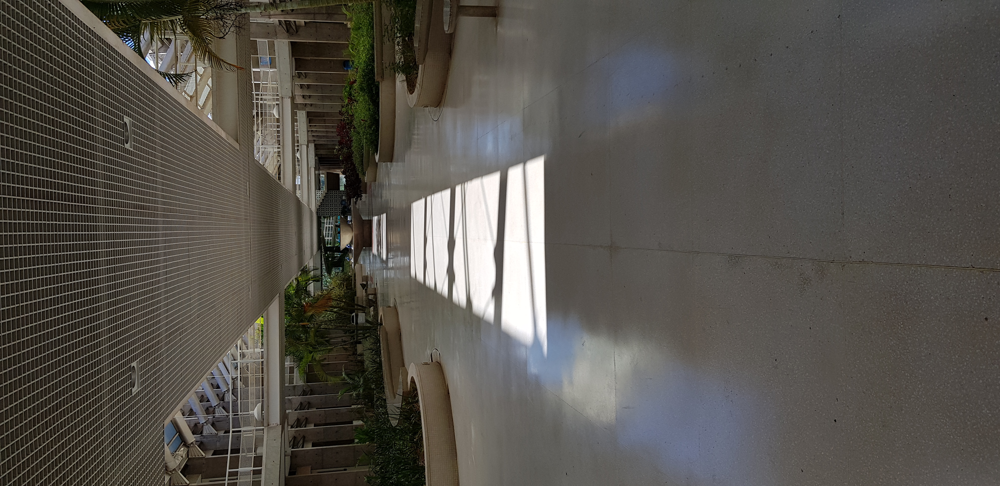
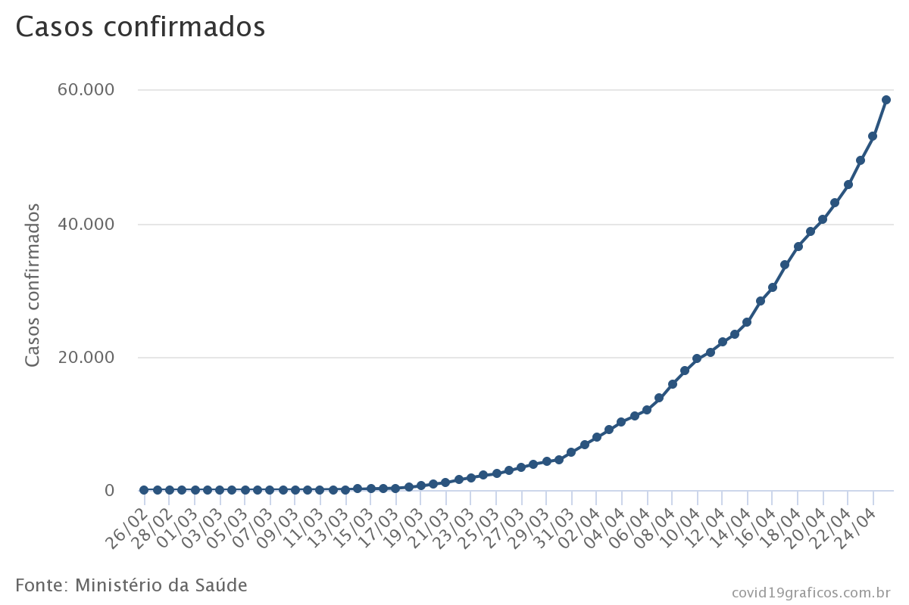

        

Estamos no primeiro semestre de 2020, vivendo a paior pandemia dos últimos 100 anos. Desde o dia 12 de Março todas as aulas estão suspensas em Brasília, cidade onde moro. Não só isso, mas o comércio está fechado, parques públicos estão trancados e a recomendação, no mundo todo, é a mesma: fique em casa. Como trabalho na Universidade, estou em regime de "home office", no entanto, não tenho cromatógrafos e espectrômetros em casa, o que significa que minhas tarefas diminuiram consideravelmente.

Os primeiros dias em casa não foram fáceis, e isso foi bem curioso pra mim. Sempre tive "facilidade" em ficar em casa, à toa, desde adolecente. Nas férias, nunca me importei em não viajar ou sair. Quando me formei na UnB, enquanto tentava decidir o que faria da vida (e tendo o privilégio de continuar morando com meus pais enquanto isso), fiquei por 1,5 ano quase sem trabalhar, procurando emprego na minha área, estudando (não muito) pra concursos e claro, viajando na internet. Já nesta pandemia, em uma semana eu já estava ansioso. 

O motivo não é exclusivo meu, pelo contrário, tem sido debatido bastante nesses dias: como ficar em casa sem fazer nada, enquanto "o mundo acaba"? A vontade é de fazer "algo" para ajudar. Como cientista, obviamente esse seria o campo em que talvez pudesse contribuir, no entanto, o desenvolvimento de vacinas ou estudo de vírus estão bem longe da minha área de atuação. Um tanto quanto fissurado nos números de casos pelo mundo, percebi que havia uma escassez de sites com dados e visualizações sobre o Brasil, que no momento tinha menos de 100 casos confirmados. Decidi então gastar um pouco de tempo com isso, inclusive para me distrair. 

Pode soar um contra-senso, eu sei. Me distrair da pandemia olhando pros números da pandemia? Mas a verdade é que ao abrir o RStudio e começar a escrever scripts para obter, manipular e plotar os gráficos, na maior parte do tempo eu estava imerso na programação e nas figuras, e o que elas representavam, por alguns instantes, não tinha significado. E mesmo depois, com gráficos prontos (ou uma primeira versão deles), eu tinha à minha disposição ferramentas para olhar com frieza os números, para o bem e para o mal. Obviamente, não sou epidemiologista, mas sinto confiança em olhar meus próprios gráficos sabendo as nuances dos dados que estão ali representados, e a qualquer momento posso adaptá-los para gerar uma imagem mais real. 

Compartilhei os gráficos com alguns amigos, que gostaram, e logo surgiu a ideia de criar um [site](http://covid19graficos.com.br/) para colocá-los na internet. Por que não? Fiz uma nova página no meu site (versão antiga), e comecei a atualizar as imagens diariamente. Como em todo projeto novo, a todo momento procurava novos gráficos e formas de melhorar os já existentes. Cerca de duas semanas, depois, o formato começou a me incomodar. Um site com mais de 50 imagens estáticas diferentes definitivamente não é a melhor forma de se apresentar dados na internet. Isso ficou ainda mais claro conforme fui descobrindo outros sites com visualizações da COVID-19, tanto internacionais como brasileiros. 

Comecei a pensar, então, em uma nova forma de apresentar esses dados. A necessidade fundalmenta era que fosse algo interativo, com uma usabilidade mínima que se espera de uma página na internet do século XXI. A minha primeira ideia (que na verdade já existia antes mesmo do site), era utilizar R + Shiny, mas a hospedagem disso é completamente impeditiva para alguém que não queria gastar muito dinheiro com mais um projeto oriundo do tédio (e de uma pandemia, nesse caso). Comecei a pesquisar, e depois de postergar por alguns dias, com medo do desafio, comecei a aprender a usar a biblioteca [Highcharts](https://www.highcharts.com/).

    

Hoje, considero que estou tendo um resultado muito satisfatório com o Highcharts. Definitivamente é uma ferramenta muito poderosa e versátil. E o que esse site tem a ver com tudo isso? Bom, durante as muitas horas navegando por sites sobre COVID-19 na internet, me deparei com um site que dizia ter sido contruído com [Gatsby.js](http://covid19graficos.com.br/). Neste momento, descobri um novo mundo na criação de sites estáticos. Não que isso seja uma novidade tecnológica - longe disso - mas pra mim era, e eu poderia sair do século XX com "meus sites". O motivo para isso é simples: os sistemas para construção de sites tradicionais requerem um servidor com hospedagem paga e uma manutenção bem chata, mas com Gatsby.js eu poderia criar um site moderno e ao mesmo tempo hospedá-lo de graça no meu querido [GitHub Pages](https://pages.github.com/).

Depois de mais um período de enrolação, decidi testar o Gatsby. E assim finalmente chegamos ao título desse post: a nova versão do meu site pessoal. Achei que seria prudente começar com um projeto mais simples, e nada mais simples do que o meu site que, até então, consistia em uma página e alguns links. E eu definitivamente estava certo! Depois de fazer e publicar a primeira versão deste novo site (antes mesmo deste blog), comecei a trabalhar na migração do Cvid19Graficos.com.br para o Gatsby. E até agora, tem sido um desastre! Na verdade, nos últimos dias até parei de insistir. Apesar de ter me dado muito bem com meus dois novos amigos, Highcharts e Gatsby, nós três juntos não estamos em sintonia. Quem sabe no futuro? 

Por hora, é isso. Um fato curioso: a história deste site é, também, a história desse blog. Após o fracasso com a migração dos gráficos, resolvi criar um blog aqui, e este é o primeiro post criado de fato para este blog. Veremos se não será também o último (você muito provavelmente não sabe, mas este é o meu terceiro blog, hahaha). 
